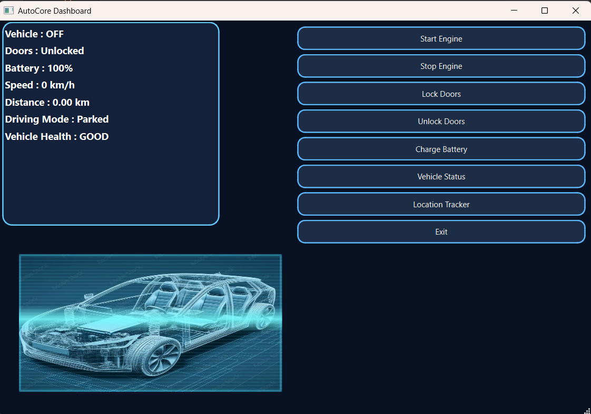

# AutoCore – Automotive Vehicle Simulation Platform

AutoCore is a modular automotive vehicle simulation platform developed in modern C++.

The project models vehicle subsystems and their interactions through a service-oriented architecture, while providing a Qt6-based interface for vehicle monitoring and control.

## Dashboard



## Features

- Modular automotive service architecture
- Engine service
- Battery service
- Climate control service
- Door service
- Vehicle state management
- Sensor simulation and monitoring
- Vehicle health analysis
- Fault management
- Centralized service management
- Service Factory for modular service creation
- Observer pattern for state/notification handling
- Multithreaded simulation
- Mutex-based synchronization
- SQLite-based data persistence
- Logging and diagnostics
- Qt6 graphical dashboard
- CMake-based build system

## Architecture

The application is organized around independent vehicle services coordinated by central management components.

```text
                    ┌─────────────────────┐
                    │     Qt6 Dashboard   │
                    └──────────┬──────────┘
                               │
                    ┌──────────▼──────────┐
                    │ Vehicle Controller  │
                    └──────────┬──────────┘
                               │
             ┌─────────────────▼─────────────────┐
             │          Service Manager         │
             └───────┬─────────┬─────────┬──────┘
                     │         │         │
                ┌────▼───┐ ┌──▼────┐ ┌──▼──────┐
                │ Engine │ │Battery│ │ Climate │
                │Service │ │Service│ │ Service │
                └────────┘ └───────┘ └─────────┘
                     │         │         │
                     └─────────┼─────────┘
                               │
                    ┌──────────▼──────────┐
                    │  Vehicle State /    │
                    │ Sensor Management   │
                    └──────────┬──────────┘
                               │
                    ┌──────────▼──────────┐
                    │ SQLite Persistence  │
                    └─────────────────────┘